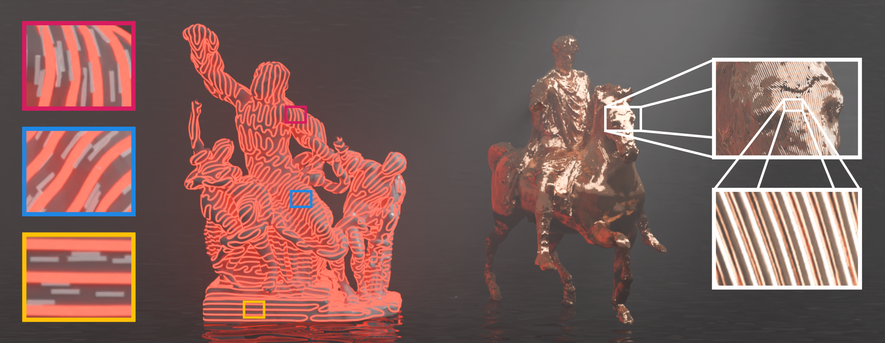
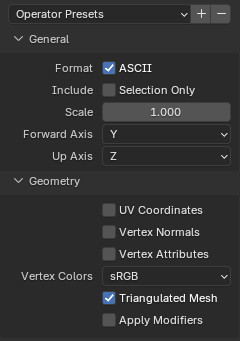
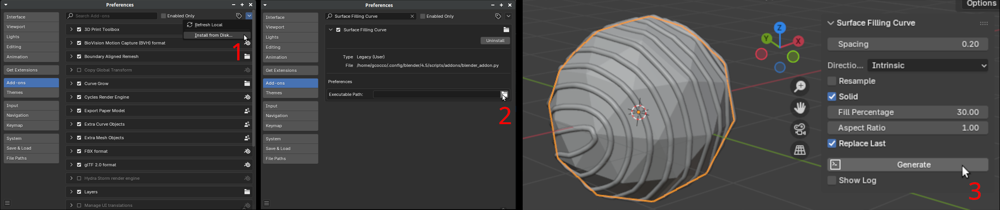

# Field-Aligned Surface-Filling Curve via Implicit Stitching

This repository contains the reference implementation of **Field-Aligned Surface-Filling Curve via Implicit Stitching**. It allows the generation of continuous, field-aligned curves on triangulated meshes. For more details, refer to the [project page](https://xavierchermain.github.io/publications/surface-filling-curve).



## Replicability

This code has received the Graphics replicability stamp.

[](http://www.replicabilitystamp.org#https-github-com-iota97-surface-filling-curve)

## Building

The project is designed with minimal dependencies in mind, relying only on the C++17 standard library. This makes the build process straightforward.

### Unix-like systems

Run the following commands:

```
mkdir build && cd build
cmake ..
make -j8
```

### Windows

Create a folder named `build` and run CMake as on Unix-like systems. Then, open the generated solution with Visual Studio and compile it. 
Precompiled binaries are also available [here](https://github.com/iota97/Surface-Filling-Curve/releases).

## Running the Code
Run the program from the `build` folder using the following command:
```
./curve input_mesh.(ply|obj) curve_spacing [-e|-i|-p|-n] [-r] [-q] [-c curve.ply] [DEBUG_OPTIONS]
```
where the basic parameters are:
```
input_mesh.(ply|obj): Input mesh to be processed. For PLY files, only the ASCII format is supported.  
curve_spacing: Target distance between parallel segments of the curve.

[-e]: Initialize the direction field using vertex colors as 3D directions. [Default]
[-i]: Initialize the direction field using vertex color luminosity as an angle (0° to 180°) from a smooth direction field.  
[-p]: Initialize the direction field using vertex color luminosity as an angle (0° to 180°) from a smooth direction field parallel to the mesh borders.
[-n]: Initialize the direction field using vertex color luminosity as an angle (0° to 180°) from the direction of the closest mesh borders.  
[-r]: Uniformly resample the curve. This does not guarantee that the curve remains on the surface.
[-R]: Repulse the curve and greatly improve spacing [Experimental].
[-q]: Suppress console output.  
[-c curve.ply]: Export the curve as a polyline.
```
and the advanced debug options are:
```
[-x]: Disables the stitching step.
[-l]: Initialize the direction field using vertex color luminosity as an angle (0° to 180°) for 3D printing. This option works only on layers like geometries, not on general ones where multiple curves may be produced.
[-C thick_curve.ply]: Export the curve as a solid mesh.
[-s scalars.ply]: Export the scalar field as a vertex-colored mesh.
[-P stripes.ply]: Export the stripe pattern as a vertex-colored mesh.  
[-d directions.ply]: Export the direction field as a vertex-colored mesh.  
[-D thick_directions.ply]: Export the direction field as a solid mesh.  
[-g disk_cut.ply]: Export the edge cuts that convert the mesh into a topological disk.
[-o medial_axis.obj]: Export the OBJ for Surface-Filling Curve Flows via Implicit Medial Axes.
```

To reproduce the results shown in **Figure 19**, simply run the following commands:

```
./curve ../data/bunny.ply 4.0 -c ../data/curve_4.ply
./curve ../data/bunny.ply 2.0 -c ../data/curve_2.ply
./curve ../data/bunny.ply 1.0 -c ../data/curve_1.ply
```

The resulting curves are standard PLY files and can be opened with any 3D software, such as Blender.

### Improving Spacing
The option `-R` applies a post-processing step using the [implicit medial axis](https://github.com/yutanoma/surface-filling-curve-flows). While it is still experimental and was not used in the article, we strongly recommend using it to improve the spacing near singularity points.

### Mesh Input Format

The input mesh must be both vertex and edge manifold. The direction field can be provided using the vertex color attributes of the PLY file format. Furthermore, no vertex seams should be present. For the best quality, we advise using an isotropically triangulated mesh to avoid sliver triangles.

**Note**: Our PLY loader is naive and supports only a limited subset of the ASCII format. In particular, no attributes other than vertex position and color should be present. Please refer to the file `data/bunny.ply` for an example of the expected PLY header. To export a PLY file from Blender, use the following export options.



### Blender 4.5 Add-on

We provide an add-on to use the code in Blender 4.5 LTS. To install the plugin, follow these steps:

1. In Blender, select `Edit → Preferences`, then go to the `Add-ons` tab. Click `Install from Disk` and select the file `blender_addon.py`.
2. Expand the newly installed add-on and, under `Executable Path`, select the executable produced when building the project.
3. The add-on is accessible from the side panel (press **N** to open it). Select a mesh and click `Generate` to produce the surface-filling curve.



## Citation
If you use this code in your research, please cite:

```
@article{Cocco2026FieldAlignedSurface,
  author = {Cocco, Giovanni and Chermain, Xavier},
  title = {Field-Aligned Surface-Filling Curve via Implicit Stitching},
  year = {2026},
  doi = {10.1111/cgf.70361},
  journal = {Computer Graphics Forum (Proceedings of Eurographics)},
}
```

## License

All files in this project are provided under the MIT License, with the exception of `src/disk.cpp`, which is provided under the MPL v2.0 as it is derived from [libigl](https://github.com/libigl/libigl).